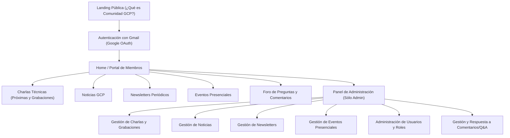
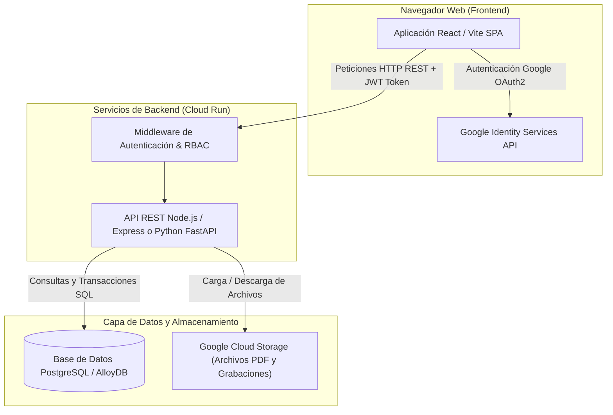
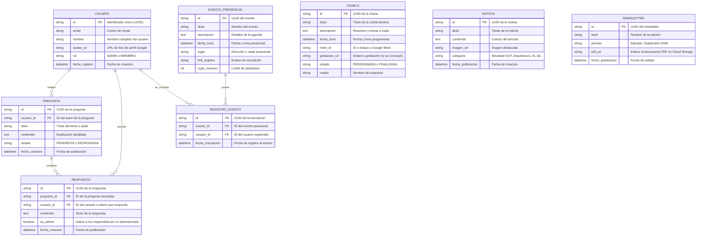

# Documento de Diseño de Aplicación Web (SDD) - Comunidad GCP

> **Proyecto**: Plataforma Web de la Comunidad GCP (Google Cloud Platform)  
> **Estado**: Propuesta de Diseño de Sistema y Arquitectura  
> **Fecha**: Septiembre 2026  

---

## 1. Visión del Producto y Objetivos de Negocio

### 1.1 Resumen Ejecutivo
La plataforma web de la **Comunidad GCP** está diseñada para ser el punto de encuentro central para arquitectos, ingenieros, desarrolladores y entusiastas de Google Cloud Platform de diversas empresas. 

El sistema facilita la interacción de la comunidad mediante:
- **Público general / Visitantes**: Presentación de la comunidad, su propósito e invitación al registro.
- **Miembros registrados**: Acceso a charlas técnicas periódicas (agendadas y grabadas con Meet ID), noticias de GCP, boletines periódicos (Newsletters), anuncios de eventos presenciales y un foro activo de preguntas y respuestas (Q&A).
- **Administradores**: Un panel integral de gestión para publicar contenido, administrar accesos de usuarios y moderar/responder consultas de la comunidad.

---

### 1.2 Referencia de Branding y Marca
- **Sitio Web de Referencia**: `https://cloud.google.com` (Analizado mediante la herramienta `read_url_content`)
- **Tono de Marca**: Innovador, técnico, corporativo, accesible y altamente confiable.
- **Inspiración Estética**:
  - Paleta de colores icónica de Google Cloud (Azul GCP, Gris Oscuro/Navy Slate para superficies, acentos en Rojo, Amarillo y Verde Google).
  - Tipografía moderna (*Google Sans* / *Inter* / *Roboto*).
  - Componentes tipo tarjetas (*cards*), sombras sutiles, detalles en *glassmorphism* y micro-animaciones fluidas.

---

### 1.3 Audiencia Objetivo y Personas

| Perfil | Descripción | Necesidades Clave |
| :--- | :--- | :--- |
| **Usuario No Registrado (Visitante)** | Profesional de TI interesado en Google Cloud. | Conocer el valor de la comunidad, temas abordados y registrarse fácilmente con Gmail. |
| **Miembro Registrado (Arquitecto / Técnico GCP)** | Miembro activo del grupo de diversas empresas. | Ver próximas charlas, links de Meet, grabaciones pasadas, newsletters, noticias de GCP, eventos presenciales y realizar preguntas/comentarios. |
| **Administrador de Comunidad** | Líder / Organizador del grupo GCP. | Publicar y editar charlas, subir grabaciones, crear noticias/newsletters, gestionar eventos, moderar usuarios y responder preguntas. |

---

### 1.4 Casos de Uso Principales

1. **[CU-01] Presentación Pública y Registro con Gmail**: Un usuario no registrado navega por la landing de bienvenida y se registra/autentica usando su cuenta de Google (Gmail / OAuth 2.0).
2. **[CU-02] Consulta de Charlas Técnicas y Grabaciones**: Los usuarios autenticados ven la agenda de próximas charlas (fecha, hora, ID de Meet) y el historial de charlas pasadas con enlace a la grabación.
3. **[CU-03] Portal de Noticias y Newsletters GCP**: Acceso a novedades tecnológicas de GCP y descarga/visualización periódica del Newsletter oficial.
4. **[CU-04] Eventos Presenciales y Registro**: Visualización de eventos presenciales organizados, incluyendo fecha, ubicación física y enlace externo/interno para confirmar asistencia.
5. **[CU-05] Foro Comunitario (Preguntas y Respuestas)**: Publicación de dudas técnicas, discusiones sobre Google Cloud y seguimiento de respuestas de administradores o pares.
6. **[CU-06] Panel de Administración Integral**: El usuario con rol Admin administra contenidos (charlas, eventos, noticias, newsletters) y listas de usuarios.
7. **[CU-07] Gestión de Q&A por Administradores**: Vista especializada para responder preguntas pendientes de los miembros y moderar comentarios.

---

## 2. Experiencia de Usuario (UX) y Diseño Visual (UI)

### 2.1 Sistema de Diseño Visual (Branding Extraído de GCP)

- **Paleta de Colores Extraída**:
  - **Azul Primario GCP**: `#1A73E8` *(Color principal para botones, enlaces y llamadas a la acción)*
  - **Azul Oscuro / Fondo**: `#0F172A` / `#1E293B` *(Estilo Dark Mode profesional con alto contraste)*
  - **Superficie / Cards**: `#1E293B` con bordes `#334155` y acento sutil azul
  - **Acentos de Marca Google**:
    - Rojo: `#EA4335`
    - Amarillo: `#FBBC04`
    - Verde: `#34A853`
  - **Texto Principal**: `#F8FAFC` *(Blanco puro / gris claro para máxima legibilidad)*
  - **Texto Secundario**: `#94A3B8` *(Gris neutro para subtítulos y metadatos)*

- **Tipografía**: `Google Sans`, `Inter`, `Roboto`, `sans-serif`.
- **Componentes y Bordes**: Radios de borde moderados (8px a 12px), sombras `0 10px 25px -5px rgba(0, 0, 0, 0.3)`, efectos de *hover* dinámicos con resplandor (*glow*) azul.

---

### 2.2 Mapa del Sitio (Sitemap)



---

### 2.3 Especificación de Pantallas y Wireframes

#### 1. Landing Pública (Usuario No Registrado)
- **Header**: Logo Comunidad GCP + Botón "Iniciar Sesión con Google".
- **Hero Section**: Título llamativo *"Comunidad de Arquitectos y Especialistas en Google Cloud"*, descripción del grupo y llamada a la acción (*CTA*).
- **Pilares del Grupo**: Tarjetas informativas sobre Charlas Semanales, Eventos Presenciales, Newsletters y Networking entre profesionales.
- **Footer**: Enlaces de contacto y disclaimer de marca.

#### 2. Portal de Miembros (Usuario Registrado)
- **Barra de Navegación**: Menú superior con pestañas: `Charlas`, `Noticias`, `Newsletter`, `Eventos Presenciales`, `Foro Q&A` y enlace al `Panel Admin` (si es administrador).
- **Sección Charlas**: 
  - Tab 1: *Próximas Charlas* (Fecha, hora, conferencista, ID de Meet y botón "Unirme").
  - Tab 2: *Charlas Grabadadas* (Buscador, tarjetas con video/grabación embebida y material adjunto).
- **Sección Noticias GCP**: Tarjetas con artículos de novedades oficiales y análisis de arquitecturas.
- **Sección Newsletter**: Listado de ediciones mensuales con visor PDF embebido y opción de descarga.
- **Sección Eventos Presenciales**: Tarjetas de eventos con mapa/lugar, fecha, cupos y botón de registro.
- **Sección Foro Q&A**: Lista de hilos de discusión, formulario para hacer nueva pregunta y filtro por estado (Respondida / Pendiente).

#### 3. Panel de Administración
- **Dashboard de Métricas**: Total usuarios, charlas programadas, preguntas pendientes de respuesta.
- **Tablas de Gestión**: Formularios modales para crear/editar registros con validación de datos.

---

## 3. Arquitectura General del Sistema

### 3.1 Diagrama de Arquitectura de Componentes



---

### 3.2 Stack Tecnológico Seleccionado

- **Frontend**: React.js / Vite, TypeScript, Vanilla CSS3 / TailwindCSS con diseño personalizado Google Cloud, Lucide Icons.
- **Backend**: Node.js con Express o Python con FastAPI / Pydantic.
- **Base de Datos**: PostgreSQL / AlloyDB para relaciones estructuradas.
- **Autenticación**: Google OAuth 2.0 (Google Identity Services) + JWT para manejo de sesiones en backend.
- **Almacenamiento de Archivos**: Google Cloud Storage (para guardar PDFs de Newsletters e imágenes).
- **Despliegue**: Google Cloud Run (Servicios en contenedores Docker).

---

## 4. Modelo de Datos y Especificación de Entidades

### 4.1 Diagrama Entidad-Relación (ER)



---

## 5. Definición de API y Contratos de Comunicación

### 5.1 Endpoints HTTP (REST)

#### 1. Autenticación Google (`POST /api/v1/auth/google`)
- **Descripción**: Procesa el token de Google Identity recibido en frontend, verifica el perfil y retorna JWT del sistema.
- **Request Body**:
```json
{
  // Token de credencial entregado por Google Sign-In
  "credential_token": "eyJhbGciOiJSUzI1NiIsI..."
}
```
- **Response (200 OK)**:
```json
{
  "status": "success",
  "data": {
    "token": "eyJhbGciOiJIUzI1NiIsInR5cCI6IkpXVCJ9...",
    "user": {
      "id": "usr_123456",
      "email": "arquitecto@empresa.com",
      "nombre": "Carlos Gómez",
      "rol": "MIEMBRO",
      "avatar_url": "https://lh3.googleusercontent.com/a/..."
    }
  }
}
```

#### 2. Gestión de Charlas (`GET /api/v1/charlas` & `POST /api/v1/charlas`)
- **GET `/api/v1/charlas?tipo=programadas`**: Retorna charlas pendientes con `meet_id`, fecha y hora.
- **GET `/api/v1/charlas?tipo=finalizadas`**: Retorna charlas pasadas con `grabacion_url`.
- **POST `/api/v1/charlas` (Solo Admin)**:
```json
{
  "titulo": "Implementación de AlloyDB y GenAI en Google Cloud",
  "descripcion": "Análisis profundo de arquitectura de datos híbrida con vectores.",
  "fecha_hora": "2026-10-15T18:00:00Z",
  "meet_id": "abc-defg-hij",
  "orador": "Ing. María Rodríguez"
}
```

#### 3. Gestión de Newsletters (`GET /api/v1/newsletters` & `POST /api/v1/newsletters`)
- **GET `/api/v1/newsletters`**: Lista de boletines ordenados por fecha.
- **POST `/api/v1/newsletters` (Solo Admin)**: Carga de nuevo boletín en PDF.

#### 4. Gestión de Eventos Presenciales (`GET /api/v1/eventos` & `POST /api/v1/eventos`)
- **GET `/api/v1/eventos`**: Retorna eventos con fecha, lugar y `link_registro`.

#### 5. Foro Q&A (`GET /api/v1/preguntas`, `POST /api/v1/preguntas`, `POST /api/v1/preguntas/:id/respuestas`)
- **POST `/api/v1/preguntas`**: Crea una consulta por parte de un usuario autenticado.
- **POST `/api/v1/preguntas/:id/respuestas`**: Permite contestar una pregunta (con indicador de admin si es moderador).

---

## 6. Seguridad, Autenticación y Autorización

### 6.1 Autenticación y Control de Sesión
- Autenticación mediante **Google OAuth 2.0 / OpenID Connect**.
- Validación de tokens JWT en backend con expiración de 24 horas para mantener la experiencia fluida.

### 6.2 Matriz de Control de Acceso (RBAC)

| Módulo / Acción | Usuario No Registrado | Usuario Registrado (Miembro) | Administrador (Admin) |
| :--- | :---: | :---: | :---: |
| Ver Landing Informativa | ✅ | ✅ | ✅ |
| Ver Próximas Charlas & Meet ID | ❌ | ✅ | ✅ |
| Ver Grabaciones de Charlas | ❌ | ✅ | ✅ |
| Leer Noticias y Newsletters | ❌ | ✅ | ✅ |
| Ver Eventos Presenciales | ❌ | ✅ | ✅ |
| Crear Preguntas y Comentarios | ❌ | ✅ | ✅ |
| Crear/Editar Charlas y Grabaciones | ❌ | ❌ | ✅ |
| Crear/Editar Noticias y Newsletters | ❌ | ❌ | ✅ |
| Crear/Editar Eventos Presenciales | ❌ | ❌ | ✅ |
| Administrar Usuarios y Asignar Roles | ❌ | ❌ | ✅ |
| Contestar y Moderar Preguntas | ❌ | ❌ (Solo ver/comentar) | ✅ (Respuesta oficial Admin) |

---

## 7. Plan de Traspaso (Handover) a Subagentes Técnicos

### 7.1 Indicaciones para Subagente Frontend (`web-app-frontend`)
- Implementar la interfaz en React con la paleta cromática extraída de Google Cloud (Azul `#1A73E8`, Fondo `#0F172A`).
- Crear vistas dedicadas para Landing Pública, Dashboard de Charlas, Noticias, Newsletters, Eventos, Foro Q&A y Panel Admin.
- Incluir soporte para login con botón de Google.

### 7.2 Indicaciones para Subagente Backend (`web-app-backend`)
- Construir los controladores API REST especificados con validación de tokens JWT.
- Integrar la verificación de Google Auth ID Token.
- **IMPORTANTE**: Incluir siempre comentarios en el código en español (según las reglas globales del usuario).

### 7.3 Indicaciones para Subagente de Base de Datos (`web-app-database`)
- Generar esquemas SQL/DDL con claves primarias UUID, referencias foráneas e índices para búsquedas rápidas por fecha.

---
