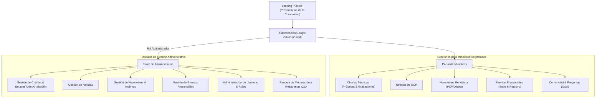
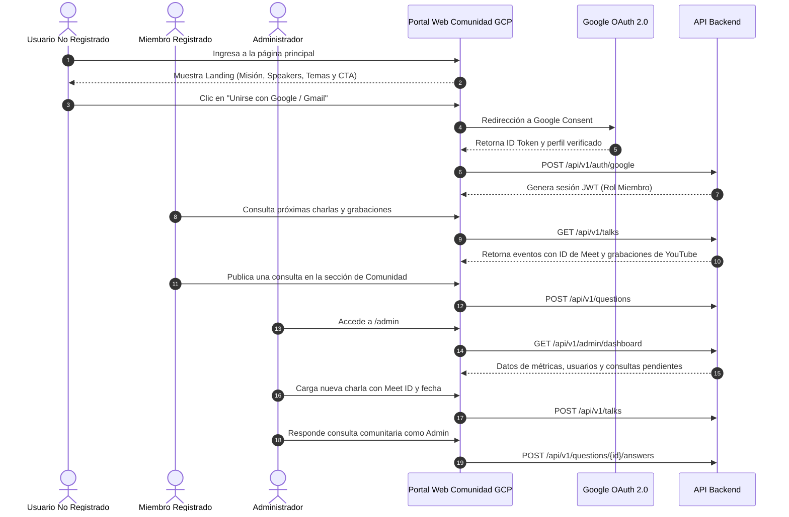
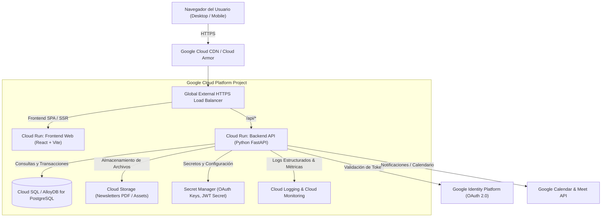

# Documento de Diseño de Software (SDD) - Comunidad GCP

> **Proyecto**: Plataforma Web Oficial de la Comunidad GCP (Arquitectos y Técnicos Google Cloud)  
> **Estado**: Aprobado para Desarrollo  
> **Versión**: 1.0.0  
> **Fecha**: Septiembre 2026  

---

## 1. Visión del Producto y Objetivos de Negocio

### 1.1 Resumen Ejecutivo
La **Comunidad GCP** es un ecosistema colaborativo que nuclea a arquitectos de soluciones, ingenieros de datos, especialistas DevOps y líderes técnicos de diversas empresas que implementan y operan sobre Google Cloud Platform. 

La plataforma web de la Comunidad GCP resuelve la necesidad de centralizar el conocimiento, la coordinación de actividades y el networking profesional del grupo a través de un portal moderno, confiable y seguro. Permite a usuarios no registrados descubrir la propuesta de valor del grupo, registrarse ágilmente mediante autenticación federada con cuenta de Google (Gmail/Workspace), acceder a charlas técnicas en vivo (con enlaces a Google Meet), consultar el repositorio histórico de grabaciones, mantenerse informados con noticias oficiales y newsletters mensuales de novedades de GCP, agendarse a eventos presenciales y participar activamente en un espacio comunitario de debate y consultas técnicas.

Asimismo, provee a los administradores de la comunidad un panel de control integral para orquestar los contenidos, moderar debates y gestionar la membresía sin requerir conocimientos técnicos de infraestructura.

### 1.2 Referencia de Branding y Marca
- **Sitio Web de Referencia**: `https://www.awwwards.com/` (Analizado mediante la herramienta `read_url_content`).
- **Tono de Marca**: Sofisticado, minimalista, vanguardista y con fuerte identidad de ingeniería tecnológica.
- **Inspiración Estética**:
  - Estilo de diseño editorial y tipografía limpia de alta legibilidad (`Inter Tight`, `Inter`).
  - Fondo orgánico claro (`#F8F8F8`) con contenedores y tarjetas en blanco puro (`#FFFFFF`) y bordes suaves (`#EDEDED`).
  - Paleta base en contrastes profundos (`#222222`) combinada con el acento enérgico característico de Awwwards (`#FA5D29` / Coral cálido) y acentos cromáticos propios del ecosistema de Google Cloud: Azul Google Cloud (`#1A73E8`), Verde (`#34A853`), Amarillo (`#FBBC04`) y Rojo (`#EA4335`).
  - Microinteracciones ágiles, badges de categorización redondeados (pills) y separación modular de contenido.

### 1.3 Audiencia Objetivo y Personas
1. **Visitante / Usuario No Registrado**:
   - *Perfil*: Arquitecto cloud, desarrollador o curioso tecnológico interesado en conocer las actividades y beneficios de sumarse a la comunidad.
   - *Objetivo*: Comprender la misión, revisar actividades recientes y registrarse en 1 clic con su cuenta de Google.
2. **Miembro Registrado (Arquitectos y Técnicos)**:
   - *Perfil*: Profesionales activos en empresas del ecosistema utilizando Google Cloud (Fintech, Retail, Banca, Startups, Telcos).
   - *Objetivo*: Conectarse a charlas virtuales (obtener link/ID de Meet), ver grabaciones de sesiones pasadas, leer newsletters y noticias de GCP, reservar asistencia a eventos presenciales y publicar dudas o intercambiar mejores prácticas en la sección de preguntas.
3. **Administrador de la Comunidad (Organizador)**:
   - *Perfil*: Líderes del grupo y Developer Advocates encargados de mantener activa la comunidad.
   - *Objetivo*: Programar y publicar charlas periódicas (enlaces Meet), subir grabaciones, redactar noticias, publicar newsletters en PDF/formato digital, gestionar eventos presenciales, aprobar o administrar usuarios y responder de forma oficial a las preguntas comunitarias.

### 1.4 Casos de Uso Principales
- **[CU-01] Exploración Pública**: El usuario no autenticado visualiza la landing informativa con la descripción del grupo, estadísticas, próximos hitos y llamados a la acción.
- **[CU-02] Registro e Inicio de Sesión Google OAuth**: Acceso seguro con 1 clic mediante Google Identity Services (Gmail / Google Workspace).
- **[CU-03] Visualización de Charlas Periódicas (Próximas y Pasadas)**: Calendario de charlas con expositor, empresa, temática, fecha/hora, enlace a Google Meet y archivo de grabaciones con buscador.
- **[CU-04] Novedades y Centro de Noticias GCP**: Feed de noticias y anuncios relevantes de la nube categorizados por productos (IA/Vertex AI, BigQuery, Kubernetes/GKE, Seguridad).
- **[CU-05] Biblioteca de Newsletters**: Acceso y descarga de newsletters periódicos con resúmenes ejecutivos de novedades de GCP.
- **[CU-06] Eventos Presenciales**: Directorio de encuentros cara a cara con detalle de sede física, horario, agenda y botón directo al registro externo (Luma, Eventbrite o formulario oficial).
- **[CU-07] Preguntas y Comentarios (Foro Comunitario)**: Espacio interactivo donde miembros formulan preguntas técnicas y reciben respuestas de colegas y administradores.
- **[CU-08] Panel de Administración Integral**: Módulo administrativo protegido por RBAC para la carga de contenidos (charlas, videos, newsletters, noticias, eventos), gestión de usuarios y moderación de consultas.

---

## 2. Experiencia de Usuario (UX) y Diseño Visual (UI)

### 2.1 Sistema de Diseño Visual (Branding Awwwards + Google Cloud)
- **Paleta Cromática**:
  - Primario Oscuro (Texto y Contraste): `#222222`
  - Fondo Principal de Pantalla: `#F8F8F8`
  - Superficies y Tarjetas (Cards): `#FFFFFF`
  - Bordes y Separadores: `#EDEDED`
  - Acento Primario (Energía y Call to Action): `#FA5D29` (Awwwards Coral)
  - Acento Secundario (Ecosistema Google Cloud): `#1A73E8` (Google Blue)
  - Acentos de Estado y Categorías:
    - Éxito / Próxima sesión: `#34A853` (Google Green)
    - Alerta / Evento en Vivo: `#EA4335` (Google Red)
    - Novedad / Destacado: `#FBBC04` (Google Yellow)
    - Púrpura Editorial: `#502BD8`
- **Tipografía**:
  - Principal: `'Inter Tight', -apple-system, BlinkMacSystemFont, 'Segoe UI', Roboto, sans-serif`.
  - Escala Tipográfica:
    - Título Hero: `clamp(2.5rem, 5vw, 4rem)` (Font-weight: 700)
    - Título Sección (H2): `1.75rem` (Font-weight: 600)
    - Subtítulos (H3): `1.25rem` (Font-weight: 600)
    - Cuerpo de Texto: `0.95rem` a `1rem` (Line-height: 1.6)
    - Etiquetas / Badges: `0.75rem` a `0.85rem` (Font-weight: 500, Uppercase opcional)
- **Componentes Base**:
  - `Badge / Pill`: Bordes redondeados completos (`border-radius: 9999px`), fondo pastel suave y texto con contraste.
  - `Card`: Fondo blanco, borde sutil de 1px en `#EDEDED`, radio de curvatura de 12px, elevación ligera en hover (`box-shadow: 0 8px 24px rgba(0,0,0,0.06)`).
  - `Botón Primario`: Color `#222222` con texto blanco o `#FA5D29` con microinteracción hover.
  - `Botón Google Auth`: Integración visual con imagotipo oficial de Google y tipografía corporativa.

### 2.2 Mapa del Sitio (Sitemap)

### 2.3 Flujo de Usuario y Experiencia de Navegación

---

## 3. Arquitectura General del Sistema

### 3.1 Diagrama de Arquitectura en Google Cloud

### 3.2 Componentes de la Arquitectura
1. **Frontend (SPA / React)**:
   - Desarrollado con React 18+, Vite, y TailwindCSS / CSS puro con diseño responsivo.
   - Consumo asíncrono de API REST, manejo de estados con Context API o Zustand.
   - Desplegable como contenedor optimizado Nginx en Google Cloud Run.
2. **Backend API (Python FastAPI)**:
   - Diseñado siguiendo las mejores prácticas de microservicios en Cloud Run (puerto configurable vía `$PORT`, contenedor sin privilegios root, comprobación de salud en `/health`).
   - Validación rigurosa de contratos mediante esquemas Pydantic v2.
   - Seguridad con JWT y middleware de verificación de firmas OAuth de Google.
3. **Base de Datos Relacional**:
   - PostgreSQL 15+ gestionado en Cloud SQL o AlloyDB para Google Cloud.
   - Conexiones seguras a través de Cloud SQL Auth Proxy con Workload Identity.
4. **Almacenamiento de Documentos (Cloud Storage)**:
   - Bucket protegido para PDFs de newsletters y documentos técnicos con URLs firmadas (Signed URLs).

---

## 4. Modelo de Datos y Especificación de Entidades

### 4.1 Diagrama Entidad-Relación (Mermaid ER)

```mermaid
erDiagram
    %% Definicion del modelo de datos de la aplicacion
    USUARIO ||--o{ CHARLA : programa
    USUARIO ||--o{ NOTICIA : redacta
    USUARIO ||--o{ NEWSLETTER : publica
    USUARIO ||--o{ EVENTO_PRESENCIAL : organiza
    USUARIO ||--o{ PREGUNTA : formula
    USUARIO ||--o{ RESPUESTA : responde
    
    PREGUNTA ||--o{ RESPUESTA : contiene
    CHARLA ||--o| GRABACION : posee

    USUARIO {
        uuid id PK "Identificador único de usuario"
        string email "Correo Gmail / Workspace verificado"
        string nombre_completo "Nombre del profesional"
        string empresa "Empresa donde trabaja el arquitecto"
        string rol_laboral "Cargo (ej. Cloud Architect, Tech Lead)"
        string avatar_url "URL foto de perfil de Google"
        string rol_sistema "ROL: MIEMBRO o ADMIN"
        boolean activo "Estado de la cuenta"
        datetime fecha_registro "Fecha de alta"
    }

    CHARLA {
        uuid id PK "Identificador de la charla"
        string titulo "Título temático de la sesión"
        text descripcion "Resumen de lo que se aprenderá"
        string speaker_nombre "Nombre del expositor"
        string speaker_empresa "Empresa del expositor"
        string meet_id "ID de la sesión de Google Meet"
        string meet_link "Enlace directo https://meet.google.com/..."
        datetime fecha_hora "Fecha y hora pactada (UTC)"
        string estado "ESTADO: PROGRAMADA, EN_CURSO, FINALIZADA"
        uuid creado_por FK "Usuario administrador"
    }

    GRABACION {
        uuid id PK "Identificador de la grabación"
        uuid charla_id FK "Referencia a la charla correspondiente"
        string url_video "Enlace al video (YouTube / Google Drive)"
        string url_presentacion "Enlace a diapositivas (Google Slides)"
        int duracion_minutos "Duración de la sesión grabada"
        datetime fecha_publicacion "Fecha en que se subió la grabación"
    }

    NOTICIA {
        uuid id PK "Identificador de la noticia"
        string titulo "Titular de la novedad GCP"
        text contenido "Cuerpo de la noticia"
        string categoria "Categoría: IA, Data, Compute, Security"
        string url_fuente "Enlace oficial a Google Cloud Blog"
        string imagen_url "Imagen de portada"
        datetime fecha_publicacion "Fecha de lanzamiento"
        uuid publicado_por FK "Usuario administrador"
    }

    NEWSLETTER {
        uuid id PK "Identificador del newsletter"
        string titulo "Título de la edición (ej. Edición Septiembre 2026)"
        int numero_edicion "Número correlativo"
        text resumen "Resumen de novedades destacadas"
        string documento_url "Enlace de descarga a Cloud Storage (PDF)"
        datetime fecha_emision "Fecha de emisión del boletín"
        uuid creado_por FK "Usuario administrador"
    }

    EVENTO_PRESENCIAL {
        uuid id PK "Identificador del evento físico"
        string nombre "Nombre del evento presencial"
        text descripcion "Agenda y detalles de la jornada"
        string lugar_nombre "Sede (ej. Google Argentina / Google México / Auditorio Tech)"
        string direccion "Dirección física completa"
        string mapa_url "Enlace a Google Maps"
        datetime fecha_inicio "Fecha y hora de inicio"
        datetime fecha_fin "Fecha y hora de fin"
        string registro_link "Enlace de acreditación (Luma/Eventbrite/Form)"
        int cupo_maximo "Cupos disponibles"
        uuid creado_por FK "Usuario administrador"
    }

    PREGUNTA {
        uuid id PK "Identificador de la consulta"
        uuid usuario_id FK "Autor de la pregunta"
        string titulo "Pregunta concisa"
        text detalle "Explicación técnica detallada"
        string etiquetas "Tags (ej. #BigQuery #GKE #VertexAI)"
        int vistas "Contador de visualizaciones"
        boolean resuelta "Indicador de resolución"
        datetime fecha_creacion "Fecha de creación"
    }

    RESPUESTA {
        uuid id PK "Identificador de la respuesta"
        uuid pregunta_id FK "Pregunta a la que responde"
        uuid usuario_id FK "Autor de la respuesta"
        text contenido "Explicación o solución aportada"
        boolean es_oficial_admin "Destaca si proviene de un Admin de la Comunidad"
        datetime fecha_creacion "Fecha de respuesta"
    }
```

---

## 5. Definición de API y Contratos de Comunicación

### 5.1 Endpoints de Autenticación y Perfil
- `POST /api/v1/auth/google`:
  - Recibe `{ "credential": "<google_id_token>" }`.
  - Verifica firma con Google Token Verifier API.
  - Retorna token de sesión JWT y perfil de usuario con rol (`MIEMBRO` o `ADMIN`).
- `GET /api/v1/auth/me`:
  - Retorna datos del usuario autenticado actual.

### 5.2 Endpoints de Charlas Periódicas
- `GET /api/v1/talks?tipo=proximas`:
  - Retorna listado de charlas en estado `PROGRAMADA` con fecha, speaker, título y Meet ID/URL.
- `GET /api/v1/talks?tipo=pasadas`:
  - Retorna listado de charlas con grabación asociada, link a slides y duración.
- `POST /api/v1/talks` *(Requiere Rol ADMIN)*:
  - Carga una nueva charla programada o actualiza la grabación de una charla pasada.

### 5.3 Endpoints de Noticias GCP
- `GET /api/v1/news`:
  - Retorna listado paginado de noticias de GCP filtrables por categoría (`ia`, `data`, `compute`, `security`).
- `POST /api/v1/news` *(Requiere Rol ADMIN)*:
  - Crea una nueva publicación de noticia oficial.

### 5.4 Endpoints de Newsletters
- `GET /api/v1/newsletters`:
  - Retorna histórico de newsletters publicados con resumen y enlace seguro de descarga PDF.
- `POST /api/v1/newsletters` *(Requiere Rol ADMIN)*:
  - Carga una nueva edición del newsletter mensual.

### 5.5 Endpoints de Eventos Presenciales
- `GET /api/v1/events/in-person`:
  - Retorna agenda de eventos presenciales futuros y pasados con sede física y link de registro externo.
- `POST /api/v1/events/in-person` *(Requiere Rol ADMIN)*:
  - Da de alta un nuevo evento presencial en el calendario.

### 5.6 Endpoints de Comunidad y Q&A
- `GET /api/v1/questions`:
  - Lista de consultas con contador de respuestas, autor y tags.
- `POST /api/v1/questions` *(Requiere Rol MIEMBRO o ADMIN)*:
  - Crea una nueva consulta técnica comunitaria.
- `GET /api/v1/questions/{id}`:
  - Detalle de la pregunta con todas sus respuestas en orden cronológico.
- `POST /api/v1/questions/{id}/answers` *(Requiere Rol MIEMBRO o ADMIN)*:
  - Publica una respuesta. Si el usuario es administrador, el flag `es_oficial_admin` se fija automáticamente en `true`.

### 5.7 Endpoints de Administración
- `GET /api/v1/admin/users`:
  - Listado de usuarios registrados con buscador por email o empresa y opción de cambiar rol.
- `PATCH /api/v1/admin/users/{id}/role`:
  - Modifica el rol del usuario (`MIEMBRO` <-> `ADMIN`).

---

## 6. Seguridad, Autenticación y Control de Acceso (RBAC)

### 6.1 Matriz de Control de Acceso

| Funcionalidad / Módulo | Visitante Público | Miembro Registrado | Administrador GCP |
| :--- | :---: | :---: | :---: |
| Ver Landing Informativa del Grupo | ✅ | ✅ | ✅ |
| Registro e Inicio con Gmail | ✅ | ✅ | ✅ |
| Ver Próximas Charlas & Google Meet IDs | ❌ | ✅ | ✅ |
| Ver Charlas Pasadas & Grabaciones | ❌ | ✅ | ✅ |
| Leer Noticias de GCP | ❌ (Solo vista previa) | ✅ | ✅ |
| Descargar Newsletters en PDF | ❌ | ✅ | ✅ |
| Ver Eventos Presenciales & Links de Registro | ❌ (Solo resumen) | ✅ | ✅ |
| Formular Preguntas y Comentar en Q&A | ❌ | ✅ | ✅ |
| Crear Charlas y Enlazar Grabaciones | ❌ | ❌ | ✅ |
| Cargar Noticias y Newsletters | ❌ | ❌ | ✅ |
| Cargar Eventos Presenciales | ❌ | ❌ | ✅ |
| Moderar y Responder Oficialmente Preguntas | ❌ | ❌ | ✅ |
| Administrar Usuarios y Asignar Roles | ❌ | ❌ | ✅ |

---

## 7. Plan de Traspaso a Subagentes Técnicos

1. **Frontend (`web-app-frontend`)**:
   - Construir interfaz React bajo el sistema de diseño extraído de Awwwards, empleando `#F8F8F8` como fondo base, `#222222` para tipografía/botones, `#FA5D29` para acentos energéticos y colores oficiales de Google Cloud para etiquetas de tecnología.
   - Implementar vistas de Landing Pública, Dashboard de Miembros (con tabs para Charlas, Noticias, Newsletters, Eventos y Q&A) y Panel de Administración con formularios validados.
   - Incluir comentarios en español en todo el código fuente.

2. **Backend (`web-app-backend`)**:
   - Implementar endpoints FastAPI con controladores modulares (`auth`, `talks`, `news`, `newsletters`, `events`, `community`, `admin`).
   - Integrar biblioteca `google-auth` para verificación del token OAuth de Google.
   - Configurar middleware CORS seguro y endpoint `/health` para Cloud Run.

3. **Base de Datos (`web-app-database`)**:
   - Generar DDL SQL para PostgreSQL con índices sobre `meet_id`, `fecha_hora`, `categoria` y `usuario_id`.
   - Crear migraciones con Alembic y modelos SQLAlchemy 2.0.

4. **SRE / Despliegue (`google-cloud`)**:
   - Contenedores Docker multi-etapa ligeros listos para Cloud Run.
   - Configuración de Secret Manager y permisos IAM de Workload Identity.

---

## 8. Mockup Interactivo y Prototipo de Navegación

Como parte del proceso de diseño, se construyó una aplicación prototipo interactiva de alta fidelidad disponible en `mockup/index.html`.

### 8.1 Capacidades del Prototipo Interactivo
- **Conmutador de Roles en Tiempo Real**: Permite alternar con un clic entre:
  1. **Visitante (No Registrado)**: Landing informativa del grupo, estadísticas, propuesta de valor, llamado al registro y modal de inicio de sesión federado con Google OAuth (Gmail).
  2. **Miembro Registrado (Gmail)**:
     - **Charlas & Grabaciones**: Pestañas de próximas sesiones con ID de Google Meet expuesto, enlace directo y botón para agendar en Google Calendar; archivo de charlas pasadas con reproductor simulado y diapositivas en Google Slides.
     - **Noticias GCP**: Feed filtrable por categorías (IA/Vertex AI, BigQuery/Data, Compute/GKE, Seguridad).
     - **Newsletters**: Visor de resúmenes de novedades y descarga simulada de documento PDF mensual almacenado en Cloud Storage.
     - **Eventos Presenciales**: Tarjetas con sedes físicas (Auditorio Google, Campus WeWork), detalle de cupos restantes y botones de registro externo (Luma / Eventbrite).
     - **Comunidad & Q&A**: Publicación de preguntas con tags (#VertexAI, #BigQuery, #FinOps), hilos de discusión y visualización destacada de respuestas de Administradores.
  3. **Administrador GCP**:
     - Carga de nuevas charlas y enlaces de Google Meet.
     - Carga y asociación de grabaciones a charlas pasadas.
     - Carga de ediciones mensuales de Newsletters en PDF.
     - Carga de noticias oficiales de GCP con categorías y fuentes.
     - Carga de eventos presenciales con aforo y enlaces de acreditación.
     - Directorio de usuarios con conmutación dinámica de roles (`MIEMBRO` <-> `ADMIN`).
     - Bandeja de moderación y respuesta oficial a consultas de la comunidad con badge verificado.

