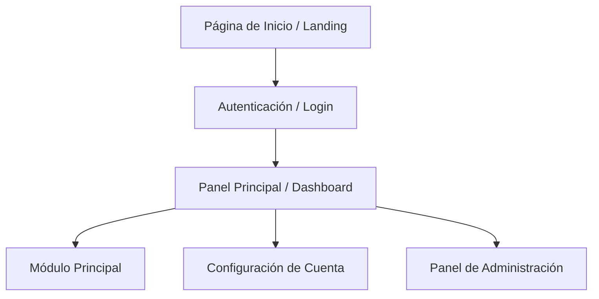
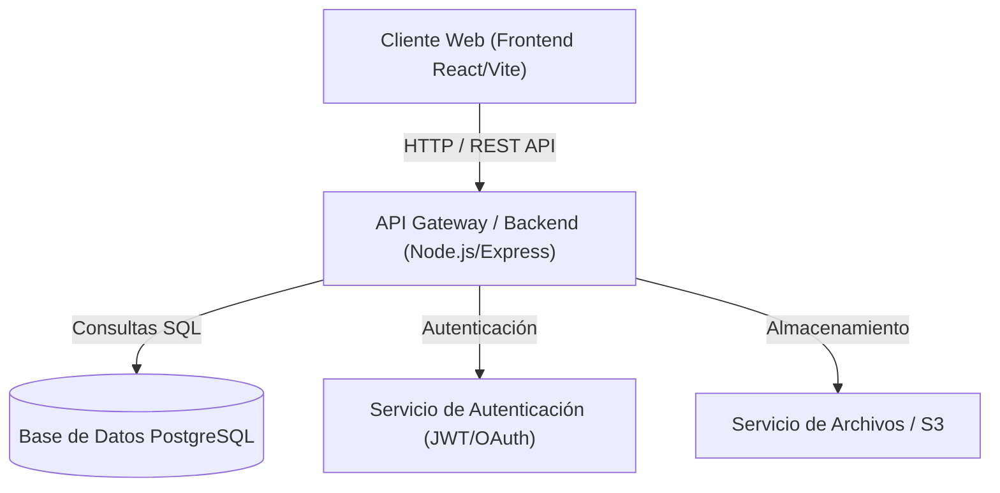
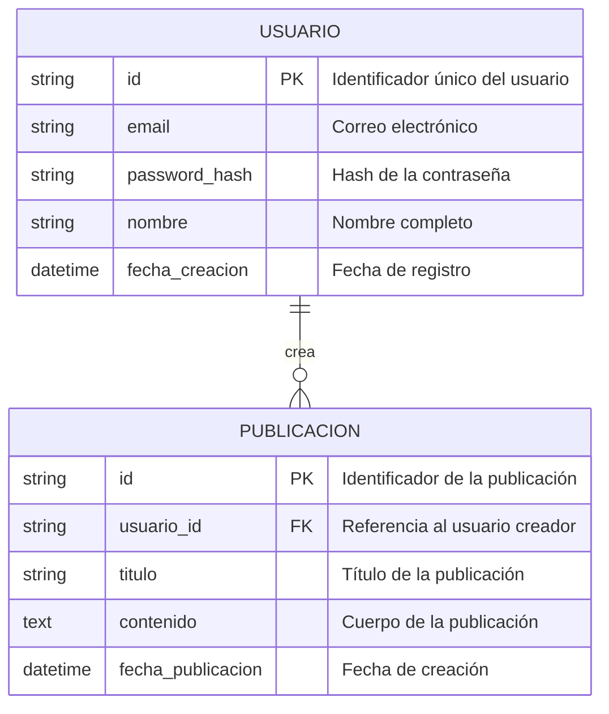

# Plantilla de Documento de Diseño de Aplicación Web (SDD)

> Este documento contiene la especificación completa del diseño de la aplicación web. Debe completarse al 100% antes de iniciar la fase de desarrollo.

---

## 1. Visión del Producto y Objetivos de Negocio

### 1.1 Resumen Ejecutivo
Breve descripción del propósito de la aplicación, el problema que resuelve y el valor entregado al usuario final.

### 1.2 Referencia de Branding y Marca
- **Sitio Web de Referencia**: `https://acme.com` (Analizado mediante la herramienta `read_url_content`)
- **Tono de Marca**: Moderno, profesional, enfocado en experiencia limpia y accesible.
- **Inspiración Estética**: Basada en la línea gráfica del sitio web de referencia.

### 1.3 Audiencia Objetivo y Personas
- **Usuario Principal**: Perfil, necesidades clave y contexto de uso.
- **Administrador**: Funciones de gestión y control.

### 1.4 Casos de Uso Principales
1. **[CU-01] Registro e Inicio de Sesión**: El usuario crea una cuenta y accede al sistema.
2. **[CU-02] Gestión Principal**: Acciones fundamentales dentro del flujo central del producto.

---

## 2. Experiencia de Usuario (UX) y Diseño Visual (UI)

### 2.1 Sistema de Diseño Visual (Branding Extraído)
- **Paleta de Colores Extraída**:
  - Primario: `#6366F1` (Color principal de la marca / Botones de acción)
  - Secundario: `#0EA5E9` (Color de acento y elementos interactivos)
  - Fondo Primario: `#0F172A` (Fondo derivado del sitio de referencia)
  - Superficie/Tarjetas: `#1E293B` (Contenedores y elevaciones)
  - Texto Principal: `#F8FAFC` (Color de contraste para legibilidad)
- **Tipografía**: Font inspirada o extraída del sitio (ej. *Inter*, *Roboto*, o *Outfit*).
- **Estilo General**: Bordes redondeados (8px-12px), sombras sutiles, micro-animaciones en hover y coherencia visual con la marca de referencia.

### 2.2 Mapa del Sitio (Sitemap)


### 2.3 Especificación de Pantallas y Wireframes
- **Pantalla de Dashboard**:
  - Header flotante alineado con la barra superior de la web de marca.
  - Sidebar interactiva plegable.
  - Sección principal con gráficos en tiempo real y tarjetas con la paleta del branding.

---

## 3. Arquitectura General del Sistema

### 3.1 Diagrama de Arquitectura de Componentes


### 3.2 Stack Tecnológico Seleccionado
- **Frontend**: HTML5, Vanilla CSS / TailwindCSS, JavaScript / TypeScript (Vite o Next.js).
- **Backend**: Node.js con Express / Fastify o Python con FastAPI.
- **Base de Datos**: PostgreSQL para datos relacionales / MongoDB para documentos.
- **Despliegue**: Cloud Run / Vercel con contenedores Docker.

---

## 4. Modelo de Datos y Especificación de Entidades

### 4.1 Diagrama Entidad-Relación (ER)


---

## 5. Definición de API y Contratos de Comunicación

### 5.1 Endpoints HTTP (REST)

#### `POST /api/v1/auth/login`
- **Descripción**: Autentica al usuario y retorna un token JWT.
- **Cuerpo de Solicitud (Request Body)**:
```json
{
  // Correo electrónico registrado del usuario
  "email": "usuario@ejemplo.com",
  // Contraseña en texto plano suministrada en el formulario
  "password": "PasswordSegura123!"
}
```
- **Respuesta Exitosa (200 OK)**:
```json
{
  // Estado de la operación
  "success": true,
  // Token de acceso JWT para peticiones autenticadas
  "token": "eyJhbGciOiJIUzI1NiIsInR5cCI6IkpXVCJ9...",
  // Datos básicos del perfil de usuario
  "user": {
    "id": "usr_987654321",
    "nombre": "Juan Pérez",
    "email": "usuario@ejemplo.com"
  }
}
```

---

## 6. Seguridad, Autenticación y Autorización

### 6.1 Mecanismo de Autenticación
- Tokens JWT (JSON Web Tokens) firmados con algoritmo HMAC SHA-256.
- Tiempo de expiración del token: 15 minutos (Refresh Token almacenado en Cookie HttpOnly con duración de 7 días).

### 6.2 Matriz de Control de Acceso (RBAC)
| Rol | Crear Contenido | Editar Propio | Editar Todos | Administrar Usuarios |
| :--- | :---: | :---: | :---: | :---: |
| **Invitado** | ❌ | ❌ | ❌ | ❌ |
| **Usuario Estándar** | ✅ | ✅ | ❌ | ❌ |
| **Administrador** | ✅ | ✅ | ✅ | ✅ |

---

## 7. Plan de Traspaso (Handover) a Subagentes Técnicos

### 7.1 Indicaciones para Subagente Frontend
- Aplicar estrictamente la paleta de colores y estilo tipográfico extraído de la marca de referencia.
- Garantizar componentes altamente pulidos y responsivos.

### 7.2 Indicaciones para Subagente Backend
- Implementar la estructura de controladores, rutas y middlewares de autenticación JWT.
- Garantizar comentarios en español en todo el código fuente.

### 7.3 Indicaciones para Subagente de Base de Datos
- Generar scripts de migración DDL SQL con claves primarias y foráneas.

### 7.4 Indicaciones para Subagente SRE / Deployment
- Crear archivo `Dockerfile` y configuración para despliegue en entorno de contenedores.
